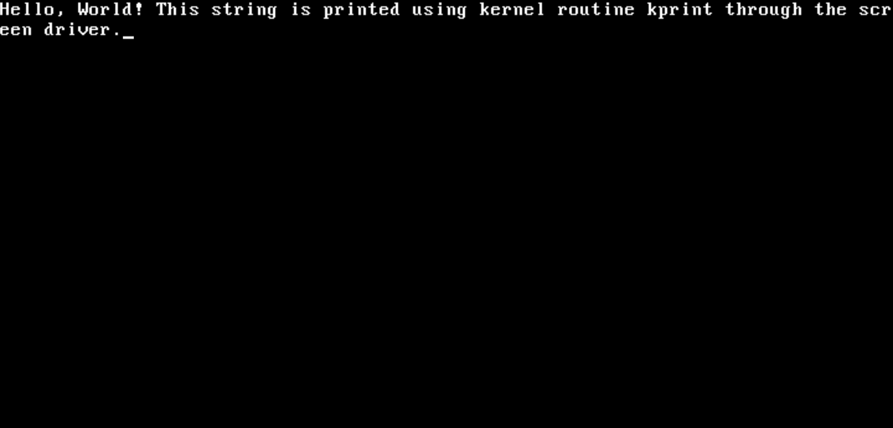
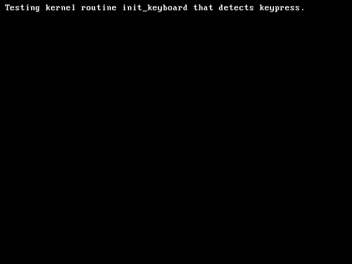

# A Simple Bootloader for x86 machine

A simple bootloader for x86 machine. It contains a kernel with screen driver. The project is tested on Qemu emulator.<br><br>
During my college years, I learned about computer system architecture and operating systems. While I gained insights through separate experiments, I always wanted a more holistic understanding of the intricate connection between hardware and software.<br><br>
This project, born from that curiosity, provides a hands-on exploration of the fascinating journey from computer hardware to software. It experiments with BIOS loading the bootsector, Memory-mapped device drivers. Then, step by step, towards a kernel using the higher-level language C is created. This project acts as an entry point to the process of building an operating system from scratch.

## Features Included
In this repository, instead of making separate folders and walking through each steps, I have uploaded a working version of the project. This includes (in order)

- BIOS loading the boot sector code
- BIOS disk read to main memory
- Switch from 16-bit real mode to 32-bit protected mode
- Screen driver
- Keyboard driver

## How To Experiment 
(for Linux )
In order to build the os-image, you will need to install NASM, Qemu and 32-bit [cross-compiler](https://wiki.osdev.org/GCC_Cross-Compiler) to compile the kernel.
Once the cross compiler is installed. Update the line 7 of makefile `CC = i686-elf-gcc` to the path of your cross-compiler installed. <br><br>
Then run these commands
```bash
git clone https://github.com/kewaltakhe/simple-kernel.git
cd simple-kernel
make clean
make
make run
```
### experiment 1: print A string using kernel routine kprint.
The `main` function of `kernel/kernel.c` is the entry point the operating system. All the functions of the OS should emerge from this `main` function. To tell kernel to print a string,  edit `kernel/kernel.c`
```c
void main(){
    isr_install();
    clear_screen();
    __asm__("sti");
    
    char myString[] = "Hello, World! This string is printed using kernel routine kprint through the screen driver.";
    kprint(myString);
}

```
qemu output


### experiment 2: detect which key is pressed.
Edit `kernel/kernel.c` and use `init_keyboard` routine

```c
void main(){
    isr_install();
    clear_screen();
    __asm__("sti");
    //__asm__ __volatile__("int $10");
    //init_timer(50);
    char myString[] = "Testing kernel routine init_keyboard that detects keypress.\n\n";
    kprint(myString);
    init_keyboard();
}
```



## Acknowledgement
- One of the best hands-on book [Writing a Simple Operating System — from Scratch by Nick Blundell](https://www.cs.bham.ac.uk/~exr/lectures/opsys/10_11/lectures/os-dev.pdf). I wish the book was longer.
- A detailed tutorial- [os-tutorial](https://github.com/cfenollosa/os-tutorial)
